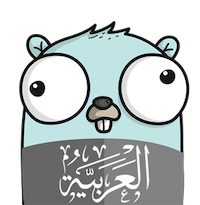
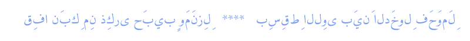
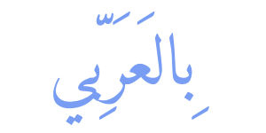

<p align="center" width="100%">
      
</p>

# ar-golang

[![GoDoc][godoc-image]][godoc-url]
[![codecov][codecov-image]][codecov-url]
[![Build Status][travis-image]][travis-url]
[](https://goreportcard.com/report/github.com/AbdullahDiaa/ar-golang)

> A set of functions for Arabic text processing in golang

> مكتبة برمجية توفر دوالاً للتعامل مع النصوص العربية في لغة برمجة  go


⚠️ The library still under active development

⚠️ المكتبة لا تزال تحت التطوير


## Features

* [x] Normalize Arabic text for processing.
* [x] Remove Harakat from Arabic text.
* [x] Arabic numbers to words.
* [x] Arabic Glyphs shaping to render Arabic text properly in images.
* [ ] Add diacritics to Arabic text [in progress]
* [ ] Hijri date support.
* [ ] English-Arabic Transliteration.
* [ ] Arabic Sentiment Analysis.

## المزايا

* [x] تنميط الحروف
* [x] اختزال التشكيل
* [x] تحويل الأعداد إلى كلمات
* [x] اصلاح تشبيك النص العربي
* [ ] تشكيل النص العربي
* [ ] التاريخ الهجري
* [ ] دعم قراءة و تحويل النص العربي لحروف انجليزية
* [ ] تحليل المشاعر في النص العربي

## Usage

### Normalization /  تنميط الحروف

```go
package main

import (
	"fmt"

	arabic "github.com/abdullahdiaa/ar-golang"
)

func main() {
     normalized := arabic.RemoveHarakat("سَنواتٌ")
	fmt.Println(normalized)
	// Output:
	// سنوات
}
```

### Arabic Glyphs shaping /  اصلاح تشبيك النص العربي

Here's an example for printing Arabic text on an image:

مثال لطباعة نص عربي علي صورة:

without the library/ من غير استخدام المكتبة

 

using the library/ باستخدام المكتبة

 


```go
package main

import (
	"image"
	"image/color"
	"image/png"
	"io/ioutil"
	"log"
	"os"

	arabic "github.com/abdullahdiaa/ar-golang"
	"golang.org/x/image/font"
	"golang.org/x/image/font/opentype"
	"golang.org/x/image/math/fixed"
)

func addLabel(img *image.RGBA, x, y int, label string) {
	//Load font file
	//You can download amiri font from this link: https://fonts.google.com/specimen/Amiri?preview.text=%D8%A8%D9%90%D8%A7%D9%84%D8%B9%D9%8E%D8%B1%D9%8E%D8%A8%D9%90%D9%91%D9%8A&preview.text_type=custom#standard-styles
	b, err := ioutil.ReadFile("Amiri-Regular.ttf")
	if err != nil {
		log.Println(err)
		return
	}

	ttf, err := opentype.Parse(b)
	if err != nil {
		log.Println(err)
		return
	}
	//Create Font.Face from font
	face, err := opentype.NewFace(ttf, &opentype.FaceOptions{
		Size:    80,
		DPI:     72,
		Hinting: font.HintingFull,
	})

	d := &font.Drawer{
		Dst:  img,
		Src:  image.NewUniform(color.RGBA{120, 157, 243, 255}),
		Face: face,
		Dot:  fixed.P(x, y),
	}

	d.DrawString(label)
}

func main() {
	img := image.NewRGBA(image.Rect(0, 0, 300, 150))
	addLabel(img, 55, 95, arabic.Shape("بِالعَرَبِّي"))

	f, err := os.Create("printed_arabic_text.png")
	if err != nil {
		panic(err)
	}
	defer f.Close()
	if err := png.Encode(f, img); err != nil {
		panic(err)
	}
}
```


## Speed
Here's a benchmark for normalizing ~78K words on MBP i5 takes about ~45ms:
```
BenchmarkNormalizeBigText-4           25          45546613 ns/op         9275097 B/op         31 allocs/op
~45 ms
```

## Documentation

You can view detailed documentation here: [GoDoc][godoc-url].

## التوثيق
يمكنك مراجعة توثيق الكود و الاستخدام الخاص بكل دالة من خلال هذا الرابط: [GoDoc][godoc-url].

## Contributing

There are many ways to contribute:
- Fix and [report bugs](https://github.com/AbdullahDiaa/ar-golang/issues/new)
- [Improve documentation](https://github.com/AbdullahDiaa/ar-golang/issues?q=is%3Aopen+label%3Adocumentation)
- [Review code and feature proposals](https://github.com/AbdullahDiaa/ar-golang/pulls)

## المشاركة
يمكنك المشاركة في تطوير المكتبة بأحد هذه الطرق:
- اصلاح المشاكل أو [الابلاغ عنها](https://github.com/AbdullahDiaa/ar-golang/issues/new)
- [تحسين التوثيق](https://github.com/AbdullahDiaa/ar-golang/issues?q=is%3Aopen+label%3Adocumentation)
- [مراجعة الكود و ارسال مقترحات لتحسينه](https://github.com/AbdullahDiaa/ar-golang/pulls)


## Changelog

View the [changelog](/CHANGELOG.md) for the latest updates and changes by
version.

## License

[Apache License 2.0][licence-url]

   Unless required by applicable law or agreed to in writing, software
   distributed under the License is distributed on an "AS IS" BASIS,
   WITHOUT WARRANTIES OR CONDITIONS OF ANY KIND, either express or implied.
   See the License for the specific language governing permissions and
   limitations under the License.


[codecov-image]: https://codecov.io/gh/AbdullahDiaa/ar-golang/branch/main/graph/badge.svg?token=2RS36L0KVL
[codecov-url]: https://codecov.io/gh/AbdullahDiaa/ar-golang
[travis-image]: https://travis-ci.com/AbdullahDiaa/ar-golang.svg?token=xpANNwyiLEp99ynBzKhp&branch=main
[travis-url]: https://travis-ci.com/AbdullahDiaa/ar-golang
[godoc-image]: https://godoc.org/github.com/AbdullahDiaa/ar-golang?status.svg
[godoc-url]: https://godoc.org/github.com/AbdullahDiaa/ar-golang
[licence-url]: https://github.com/AbdullahDiaa/ar-golang/blob/main/LICENSE